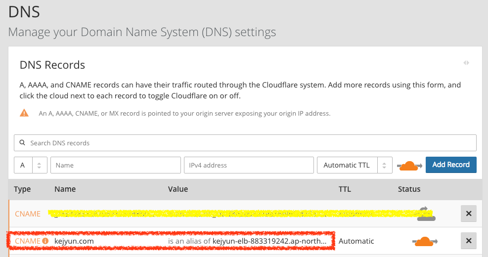

# Cloudflare

## 去掉網址前綴

在網址中通常會用 `www.kejyun.com` 去當作一個網站的首頁，但越來越多人因為沒有太多的子網域，且想讓首頁網址看起來比較清爽一點，會想要把 `www` 去掉變為 `kejyun.com`，如果需要這樣設定的話，在 cloudflare 中可以這樣做。

可以使用 CNAME 或 A 任何的方式（上圖是使用 CNAME 方式），在 cloudflare 中可以在 DNS 直接輸入該網域，DNS 會將這個網域設為 root 網域。

這樣就可以將整個網站指到 `kejyun.com`，去除前面的子網域前綴了。

## 參考資料
* [Cloudflare - The Web Performance & Security Company | Cloudflare](https://www.cloudflare.com/)
