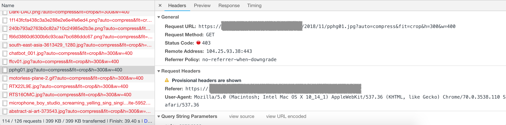
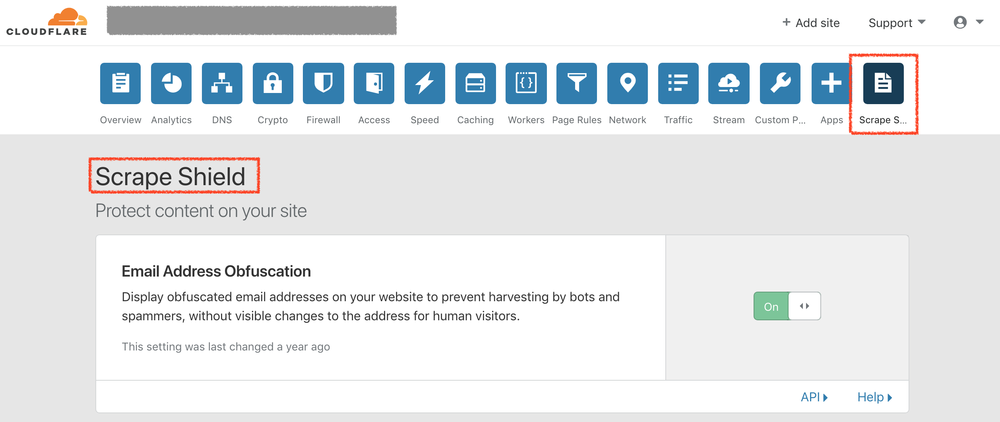
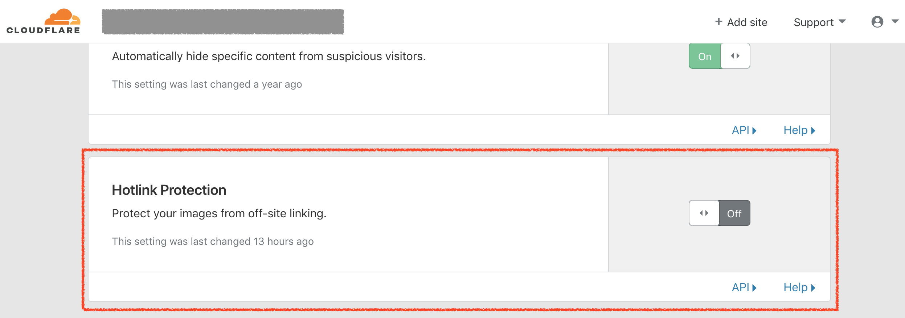

# Scrape Shield Restrict hotlinking 403 forbidden

在使用外站存取圖片時，發現被 `403 frobidden` 禁止存取





在嘗試使用 curl 去存取此連結時，可以看到回傳下列訊息


```html
curl 'https://kj.com/2018/11/KJ.png' -H 'Referer: https://kejyun.com/article' -H 'User-Agent: Mozilla/5.0 (Macintosh; Intel Mac OS X 10_14_0) AppleWebKit/537.36 (KHTML, like Gecko) Chrome/70.0.3538.102 Safari/537.36' --compressed
<!DOCTYPE html>
<!--[if lt IE 7]> <html class="no-js ie6 oldie" lang="en-US"> <![endif]-->
<!--[if IE 7]>    <html class="no-js ie7 oldie" lang="en-US"> <![endif]-->
<!--[if IE 8]>    <html class="no-js ie8 oldie" lang="en-US"> <![endif]-->
<!--[if gt IE 8]><!--> <html class="no-js" lang="en-US"> <!--<![endif]-->
<head>
<title>Access denied | kj.com used Cloudflare to restrict hotlinking</title>
<meta charset="UTF-8" />
<meta http-equiv="Content-Type" content="text/html; charset=UTF-8" />
<meta http-equiv="X-UA-Compatible" content="IE=Edge,chrome=1" />
<meta name="robots" content="noindex, nofollow" />
<meta name="viewport" content="width=device-width,initial-scale=1,maximum-scale=1" />
<link rel="stylesheet" id="cf_styles-css" href="/cdn-cgi/styles/cf.errors.css" type="text/css" media="screen,projection" />
<!--[if lt IE 9]><link rel="stylesheet" id='cf_styles-ie-css' href="/cdn-cgi/styles/cf.errors.ie.css" type="text/css" media="screen,projection" /><![endif]-->
<style type="text/css">body{margin:0;padding:0}</style>


<!--[if gte IE 10]><!--><script type="text/javascript" src="/cdn-cgi/scripts/zepto.min.js"></script><!--<![endif]-->
<!--[if gte IE 10]><!--><script type="text/javascript" src="/cdn-cgi/scripts/cf.common.js"></script><!--<![endif]-->


</head>
<body>
  <div id="cf-wrapper">
    <div class="cf-alert cf-alert-error cf-cookie-error" id="cookie-alert" data-translate="enable_cookies">Please enable cookies.</div>
    <div id="cf-error-details" class="cf-error-details-wrapper">
      <div class="cf-wrapper cf-header cf-error-overview">
        <h1>
          <span class="cf-error-type" data-translate="error">Error</span>
          <span class="cf-error-code">1011</span>
          <small class="heading-ray-id">Ray ID: 47fd22f6ead62e09 &bull; 2018-11-26 14:45:03 UTC</small>
        </h1>
        <h2 class="cf-subheadline">Access denied</h2>
      </div><!-- /.header -->

      <section></section><!-- spacer -->

      <div class="cf-section cf-wrapper">
        <div class="cf-columns two">
          <div class="cf-column">
            <h2 data-translate="what_happened">What happened?</h2>
            <p>The owner of this website (kj.com) does not allow hotlinking to that resource (/2018/11/Dark-DAO.png).</p>
          </div>


        </div>
      </div><!-- /.section -->

      <div class="cf-error-footer cf-wrapper">
  <p>
    <span class="cf-footer-item">Cloudflare Ray ID: <strong>47fd22f6ead62e09</strong></span>
    <span class="cf-footer-separator">&bull;</span>
    <span class="cf-footer-item"><span>Your IP</span>: 1.1.1.1</span>
    <span class="cf-footer-separator">&bull;</span>
    <span class="cf-footer-item"><span>Performance &amp; security by</span> <a href="https://www.cloudflare.com/5xx-error-landing?utm_source=error_footer" id="brand_link" target="_blank">Cloudflare</a></span>

  </p>
</div><!-- /.error-footer -->


    </div><!-- /#cf-error-details -->
  </div><!-- /#cf-wrapper -->

  <script type="text/javascript">
  window._cf_translation = {};


</script>

</body>
</html>
```

可以在 `<title>` 看到 `kj.com used Cloudflare to restrict hotlinking`

```
<title>Access denied | kj.com used Cloudflare to restrict hotlinking</title>
```


此時到 cloudflare `Scrape Shield` 選單關閉 `hotlinking` 即可解決此問題






## 參考資料
* [What does enabling Cloudflare Hotlink Protection do? – Cloudflare Support](https://support.cloudflare.com/hc/en-us/articles/200170026-What-does-enabling-Cloudflare-Hotlink-Protection-do-)
